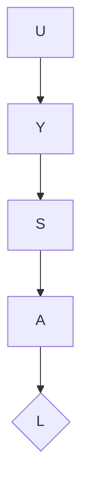

<picture>
  <source media="(prefers-color-scheme: dark)" srcset="https://raw.githubusercontent.com/uysalserkan/uysalserkan/master/charmander-2.gif">
  
</picture>

$\sqrt{Fe-el}+(free)^2$ to [contact me.](mailto:uysalserkan08@gmail.com)
<!--
<div align="center">
<p>Profile Visitor Counter</p>

</div>
-->
<!--START_SECTION:waka-->

```text
Python       8 hrs 50 mins   █████████████████████▓░░░   86.01 %
Markdown     1 hr 3 mins     ██▓░░░░░░░░░░░░░░░░░░░░░░   10.35 %
Text         13 mins         ▓░░░░░░░░░░░░░░░░░░░░░░░░   02.26 %
INI          6 mins          ▒░░░░░░░░░░░░░░░░░░░░░░░░   01.10 %
TOML         1 min           ░░░░░░░░░░░░░░░░░░░░░░░░░   00.26 %
Git Config   0 secs          ░░░░░░░░░░░░░░░░░░░░░░░░░   00.01 %
```

<!--END_SECTION:waka-->




```geojson
{
  "type": "FeatureCollection",
  "features": [
    {
      "type": "Feature",
      "properties": {},
      "geometry": {
        "coordinates": [
          [
            28.944961553996677,
            41.014229145382956
          ],
          [
            28.945053719022127,
            41.0076222473015
          ],
          [
            28.951689600802638,
            41.0076222473015
          ],
          [
            28.951597435777188,
            41.01415960253783
          ]
        ],
        "type": "LineString"
      }
    },
    {
      "type": "Feature",
      "properties": {},
      "geometry": {
        "coordinates": [
          [
            28.955284036767182,
            41.01395097356135
          ],
          [
            28.959800122978294,
            41.01130828267384
          ],
          [
            28.96330239391844,
            41.014229145382956
          ]
        ],
        "type": "LineString"
      }
    },
    {
      "type": "Feature",
      "properties": {},
      "geometry": {
        "coordinates": [
          [
            28.959800122978294,
            41.01144737431031
          ],
          [
            28.959800122978294,
            41.00769179704716
          ]
        ],
        "type": "LineString"
      }
    },
    {
      "type": "Feature",
      "properties": {},
      "geometry": {
        "coordinates": [
          [
            28.967726315105068,
            41.014437773478505
          ],
          [
            28.964408374214855,
            41.01207328304281
          ],
          [
            28.968832295401512,
            41.00984780275792
          ],
          [
            28.964224044165974,
            41.00783089631898
          ]
        ],
        "type": "LineString"
      }
    },
    {
      "type": "Feature",
      "properties": {},
      "geometry": {
        "coordinates": [
          [
            28.971136421019793,
            41.00810909398092
          ],
          [
            28.974362196885608,
            41.01395097356135
          ],
          [
            28.978509622998843,
            41.00824819237107
          ],
          [
            28.976481992453955,
            41.01103009851849
          ],
          [
            28.9727953914649,
            41.01109964466784
          ]
        ],
        "type": "LineString"
      }
    },
    {
      "type": "Feature",
      "properties": {},
      "geometry": {
        "coordinates": [
          [
            28.979339108220984,
            41.01395097356135
          ],
          [
            28.97952343827086,
            41.00803954467503
          ],
          [
            28.984131689507365,
            41.00817864321269
          ]
        ],
        "type": "LineString"
      }
    }
  ]
}
```


```stl
solid cube_corner
  facet normal 0.0 -1.0 0.0
    outer loop
      vertex 0.0 0.0 0.0
      vertex 1.0 0.0 0.0
      vertex 0.0 0.0 1.0
    endloop
  endfacet
  ...
```

