<picture>
  <source media="(prefers-color-scheme: dark)" srcset="https://raw.githubusercontent.com/uysalserkan/uysalserkan/master/charmander-2.gif">
  
</picture>

# Hi there! 👋 I'm Serkan Uysal

## 📋 Table of Contents

1. [About Me](#about-me)
2. [Skills & Technologies](#-skills--technologies)
3. [GitHub Stats](#-github-stats)
4. [Currently Learning](#-currently-learning)
5. [Featured Projects](#-featured-projects)
6. [My Learning Journey](#-my-learning-journey)
7. [Learning Resources & Bookmarks](#-learning-resources--bookmarks)
8. [Connect With Me](#-connect-with-me)

---

## About Me
I'm a passionate **Data Scientist** and **Machine Learning Engineer** with a love for solving complex problems through data-driven solutions. I enjoy working with cutting-edge ML technologies and building scalable data pipelines.

## 🚀 Skills & Technologies

### Programming Languages


### Machine Learning & Data Science


### Cloud & DevOps


### Databases


## 📊 GitHub Stats

<div align="center">
  
</div>

<div align="center">
  
</div>

<div align="center">
  
</div>

## 🌱 Currently Learning
- Advanced Deep Learning architectures
- MLOps and model deployment strategies
- Computer Vision with Transformers
- Large Language Models (LLMs)

## 📞 Connect With Me

$\sqrt{Fe-el}+(free)^2$ to reach out!

[](mailto:uysalserkan08@gmail.com)
[](https://linkedin.com/in/uysalserkan)
[](https://github.com/uysalserkan)
[](https://medium.com/@uysalserkan)

[](https://github.com/pre-commit/pre-commit)

<a target="_blank" href="https://github-readme-medium-recent-article.vercel.app/medium/@uysalserkan/0">

<!--
<div align="center">
<p>Profile Visitor Counter</p>

</div>
-->

### 🎯 What I'm Working On
- 🔬 Advanced Computer Vision projects with Transformers
- 📊 Real-time ML model deployment with MLOps best practices
- 🚀 Contributing to open-source ML libraries

## 📈 My Learning Journey

```mermaid
graph TD
    A["🎓 Computer Science Foundation"] --> B["📊 Data Science"]
    B --> C["🤖 Machine Learning"]
    C --> D["🧠 Deep Learning"]
    D --> E["👁️ Computer Vision"]
    D --> F["💬 Natural Language Processing"]
    E --> G["🚀 Production ML"]
    F --> G
    G --> H["☁️ MLOps & Cloud"]
    H --> I["🌟 Current: Advanced AI"]

    style A fill:#e1f5fe
    style I fill:#f3e5f5
    style G fill:#e8f5e8
```




```geojson
{
  "type": "FeatureCollection",
  "features": [
    {
      "type": "Feature",
      "properties": {},
      "geometry": {
        "coordinates": [
          [
            28.944961553996677,
            41.014229145382956
          ],
          [
            28.945053719022127,
            41.0076222473015
          ],
          [
            28.951689600802638,
            41.0076222473015
          ],
          [
            28.951597435777188,
            41.01415960253783
          ]
        ],
        "type": "LineString"
      }
    },
    {
      "type": "Feature",
      "properties": {},
      "geometry": {
        "coordinates": [
          [
            28.955284036767182,
            41.01395097356135
          ],
          [
            28.959800122978294,
            41.01130828267384
          ],
          [
            28.96330239391844,
            41.014229145382956
          ]
        ],
        "type": "LineString"
      }
    },
    {
      "type": "Feature",
      "properties": {},
      "geometry": {
        "coordinates": [
          [
            28.959800122978294,
            41.01144737431031
          ],
          [
            28.959800122978294,
            41.00769179704716
          ]
        ],
        "type": "LineString"
      }
    },
    {
      "type": "Feature",
      "properties": {},
      "geometry": {
        "coordinates": [
          [
            28.967726315105068,
            41.014437773478505
          ],
          [
            28.964408374214855,
            41.01207328304281
          ],
          [
            28.968832295401512,
            41.00984780275792
          ],
          [
            28.964224044165974,
            41.00783089631898
          ]
        ],
        "type": "LineString"
      }
    },
    {
      "type": "Feature",
      "properties": {},
      "geometry": {
        "coordinates": [
          [
            28.971136421019793,
            41.00810909398092
          ],
          [
            28.974362196885608,
            41.01395097356135
          ],
          [
            28.978509622998843,
            41.00824819237107
          ],
          [
            28.976481992453955,
            41.01103009851849
          ],
          [
            28.9727953914649,
            41.01109964466784
          ]
        ],
        "type": "LineString"
      }
    },
    {
      "type": "Feature",
      "properties": {},
      "geometry": {
        "coordinates": [
          [
            28.979339108220984,
            41.01395097356135
          ],
          [
            28.97952343827086,
            41.00803954467503
          ],
          [
            28.984131689507365,
            41.00817864321269
          ]
        ],
        "type": "LineString"
      }
    }
  ]
}
```

## 📚 Learning Resources & Bookmarks

<details>
<summary><strong>🤖 Machine Learning & AI</strong></summary>

### Core ML Resources
- [Awesome Production Machine Learning](https://github.com/EthicalML/awesome-production-machine-learning)
- [ML Papers Explained](https://github.com/dair-ai/ML-Papers-Explained)
- [Machine Learning Articles](https://github.com/christianversloot/machine-learning-articles)
- [Best of ML Python](https://github.com/ml-tooling/best-of-ml-python)
- [PyTorch Tutorial](https://github.com/yunjey/pytorch-tutorial)

### Computer Vision & Generative AI
- [Computer Vision in Wild!](https://github.com/Computer-Vision-in-the-Wild/CVinW_Readings)
- [Awesome Computer Vision](https://github.com/jbhuang0604/awesome-computer-vision)
- [Big Vision](https://github.com/google-research/big_vision)
- [Stable Diffusion](https://github.com/Stability-AI/stablediffusion)
- [StyleGAN3](https://github.com/NVlabs/stylegan3)
- [Awesome Diffusion Models](https://github.com/diff-usion/Awesome-Diffusion-Models)
- [ComfyUI](https://github.com/comfyanonymous/ComfyUI)
- [Open Sora](https://github.com/hpcaitech/Open-Sora)
- [Insight Face](https://github.com/deepinsight/insightface)
- [Apple ML-4M](https://github.com/apple/ml-4m)

### NLP & Language Models
- [Sentence Transformers](https://github.com/UKPLab/sentence-transformers)
- [OpenAI Cookbook](https://github.com/openai/openai-cookbook)
- [UNILM](https://github.com/microsoft/unilm/tree/master)

### Data Science & Analytics
- [Clean Lab](https://github.com/cleanlab/cleanlab)
- [Polars](https://github.com/pola-rs/polars)
- [Apache Arrow](https://github.com/apache/arrow-datafusion)
- [Awesome Open Data Centric AI](https://github.com/Renumics/awesome-open-data-centric-ai)

</details>

<details>
<summary><strong>🔧 MLOps & Data Engineering</strong></summary>

### MLOps Platforms
- [ClearML](https://github.com/allegroai/clearml)
- [ZenML](https://github.com/zenml-io/zenml)
- [MLRun](https://github.com/mlrun/mlrun)
- [Mage AI](https://github.com/mage-ai/mage-ai)
- [Phoenix](https://github.com/Arize-ai/phoenix)

### Data Pipelines & Orchestration
- [Prefect](https://github.com/PrefectHQ/prefect)
- [Kestra](https://github.com/kestra-io/kestra)
- [n8n](https://github.com/n8n-io/n8n)
- [Awesome Pipeline](https://github.com/pditommaso/awesome-pipeline?tab=readme-ov-file)
- [Elyra](https://github.com/elyra-ai/elyra)

### Data Engineering
- [Data Engineering ZoomCamp](https://github.com/DataTalksClub/data-engineering-zoomcamp)
- [Apache Druid](https://github.com/apache/druid/)
- [Apache Hudi](https://github.com/apache/hudi)
- [Apache Airavata](https://github.com/apache/airavata)

</details>

<details>
<summary><strong>💻 System Design & Engineering</strong></summary>

### System Design
- [Awesome Scalability](https://github.com/binhnguyennus/awesome-scalability)
- [Complete System Design](https://github.com/Coder-World04/Complete-System-Design)
- [System Design](https://github.com/karanpratapsingh/system-design)

### Cloud & DevOps
- [Kubernetes Learning Path](https://github.com/techiescamp/kubernetes-learning-path)

### Databases
- [CockroachDB](https://github.com/cockroachdb/cockroach)
- [PrestoDB](https://github.com/prestodb/presto)
- [TypeSense](https://github.com/typesense/typesense)

</details>

<details>
<summary><strong>📖 Learning & Career Development</strong></summary>

### Courses & Education
- [Full Stack Deep Learning](https://github.com/full-stack-deep-learning/website)
- [MLOps Course](https://github.com/SkafteNicki/dtu_mlops)
- [CS Video Courses](https://github.com/Developer-Y/cs-video-courses)

### Interview Preparation
- [ML Interview Preparation](https://github.com/ThinamXx/ML..Interview..Preparation)
- [CrackingMachineLearningInterview](https://github.com/shafaypro/CrackingMachineLearningInterview)

### Career Growth
- [Path to Senior Engineer Handbook](https://github.com/jordan-cutler/path-to-senior-engineer-handbook)

</details>

<details>
<summary><strong>🛠️ Development Tools & Resources</strong></summary>

### Development Resources
- [Build Your Own X](https://github.com/codecrafters-io/build-your-own-x)
- [Python Cheatsheet](https://github.com/gto76/python-cheatsheet)
- [FreeForDev](https://github.com/ripienaar/free-for-dev)

### Documentation & Tools
- [MKDocs](https://github.com/mkdocs/mkdocs/tree/master)
- [Pre-Commit](https://pre-commit.com/)
- [Bat](https://github.com/sharkdp/bat)

### AI Collections
- [AI Collection](https://github.com/ai-collection/ai-collection)
- [Devika](https://github.com/stitionai/devika)
- [Open Devin](https://github.com/OpenDevin/OpenDevin)
- [Instill AI](https://github.com/instill-ai)

### Miscellaneous
- [shortlink](https://github.com/shortlink-org/shortlink)

</details>

---

<div align="center">

### 🌟 Thanks for visiting! 🌟

*"The best way to predict the future is to create it"* - Peter Drucker

⭐ **Star this repo** if you found it helpful! | 🍴 **Fork it** to customize for yourself!


**Made with ❤️ by Serkan Uysal**

</div>
